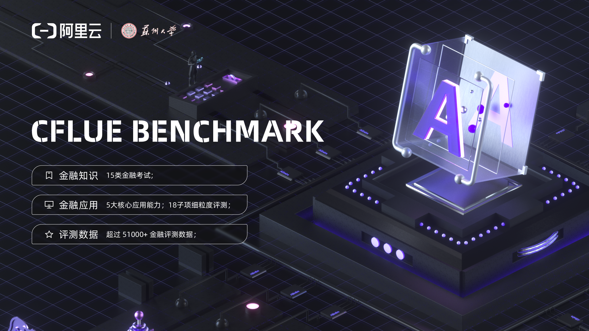
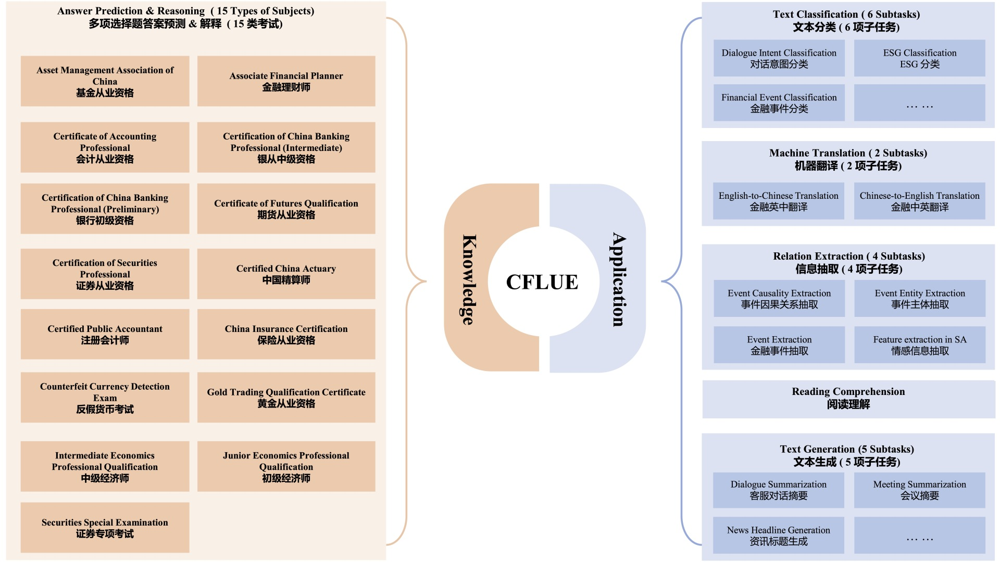

([English](./README.md)|简体中文)
# Benchmarking Large Language Models on CFLUE - A Chinese Financial Language Understanding Evaluation Dataset 

## CFLUE Version 1.0 — 金融领域中文语言理解评测数据集
阿里云、苏州大学联合推出了CFLUE（Chinese Financial Language Understanding Evaluation），这是一个新颖的、全面的评估基准，旨在评估大型语言模型在中文金融语境中的理解和处理能力。

CFLUE通过两个主要维度——**知识评估**和**应用评估**来衡量语言模型的性能。

- 知识评估部分包含超过38,000个多项选择题，这些题目选自15种不同的金融资格模拟考试，旨在测试语言模型的答案预测和推理能力。每个问题都伴随有解释，有助于深入评价模型的推理过程。
- 应用评估部分则提供超过16,000个实例，覆盖文本分类、机器翻译、关系抽取、阅读理解和文本生成等五种经典NLP任务，这些实例源自现有共享任务或由专业人员标注的真实数据。

整体而言，CFLUE为了解和提升中文金融领域LLMs的能力提供了多角度的见解，并通过CFLUE呼吁对这些模型的能力进行更全面细致的评估。研究团队期望，CFLUE不仅能促进对现有模型的深入了解，还能推动中文金融领域语言模型发展的新步伐。

目前，CFLUE V1.0 的评估数据集将向公众提供，未来计划不断更新版本并推出集成的平台化评估服务，旨在为整个行业提供全面的一站式评价解决方案。


## 更新日志

- **[2024.03.06]** CFLUE 现已开源“知识评估”的 dev 集和“应用评估”数据样例 🚀🚀🚀；
## 目录

- [排行榜](#排行榜)
- [数据](#数据)
- [快速开始](#快速开始)
- [如何提交](#如何提交)
- [TODO](#todo)
- [Licenses](#licenses)
- [引用](#引用)
## 排行榜
下面列出了我们在初始版本中进行评估的模型的zero-shot性能。我们在CFLUE上对各种大型语言模型进行了综合评估，包括OpenAI的GPT-4和GPT-4-turbo，以及多个针对通用领域和金融领域模型。结果表明，GPT-4和GPT-4-turbo在知识评估的答案预测方面明显优于其他模型，准确率超过60%，显示出它们在该领域的领先地位，但也暗示其他语言模型有显著的提升空间。在应用评估中，尽管这两个模型整体上表现优异，但它们的优势相比某些专门为中文设计的模型有所减弱。研究还发现，目前的金融领域LLMs，如FinGPT V3、DISC-FinLLM和Tongyi-Finance，在零样本测试中表现欠佳，表明这些模型在金融知识方面的覆盖还有待加强。另一方面，轻量级LLMs在经过监督微调后表现出色，如ChatGLM3-6B、Qwen-7B和Baichuan2-7B的性能在某些任务上可与参数量更大的ChatGPT媲美。

### 知识评估
| **Model** | **Acc** | **Weighted-F1** | **BLEU-1** | **BLEU-4** | **ROUGE-1** | **ROUGE-2** | **ROUGE-L** |
| --- | --- | --- | --- | --- | --- | --- | --- |
| Qwen-72B | 72.8±0.23 | 73.04±0.23 | 45.78±0.39 | 26.76±0.21 | 50.78±0.15 | 31.48±0.13 | 45.28±0.15 |
| Qwen-14B | 53.82±0.23 | 54.23±0.27 | 40.05±0.34 | 21.56±0.25 | 47.61±0.11 | 27.27±0.1 | 41.45±0.12 |
| Tongyi-Finance-14B | 47.21±0.11 | 47.07±0.16 | 38.32±0.11 | 19.24±0.05 | 44.35±0.07 | 23.55±0.06 | 38.1±0.1 |
| Qwen-7B-sft | 48.61±0.58 | 48.59±0.6 | 37.7±1.94 | 20.74±1.14 | 47.62±0.19 | 27.73±0.17 | 42.41±0.15 |
| Qwen-7B | 43.63±0.37 | 43.25±0.41 | 42.03±0.32 | 17.85±0.29 | 39.87±0.26 | 22.11±0.21 | 35.06±0.28 |
| ChatGLM3-6B-sft | 42.43±0.24 | 41.93±0.27 | 12.96±1.39 | 6.64±0.76 | 43.06±0.3 | 24.08±0.3 | 38.17±0.29 |
| Baichuan2-13B | 41.5±0.29 | 40.87±0.29 | 28.64±0.57 | 14.16±0.28 | 42.04±0.06 | 22.36±0.1 | 36.51±0.05 |
| ChatGLM3-6B | 40.78±0.33 | 41.37±0.33 | 34.7±0.47 | 16.74±0.23 | 43.74±0.08 | 22.92±0.09 | 37.68±0.04 |
| Qwen-1.8B | 38.68±0.26 | 38.53±0.26 | 40.25±0.12 | 19.01±0.08 | 42.43±0.11 | 23.08±0.09 | 37.17±0.13 |
| Baichuan2-7B | 32.31±0.14 | 28.77±0.19 | 21.71±1.36 | 0.17±0.08 | 7.54±0.12 | 3.23±0.09 | 6.9±0.12 |
| Vicuna_v1.5 | 31.14±0.37 | 30.92±0.35 | 29.6±0.21 | 12.92±0.16 | 40.68±0.11 | 19.32±0.11 | 34.27±0.07 |
| LLaMA2-7B-sft | 27.07±0.65 | 26.93±0.65 | 36.7±1.6 | 18.56±0.22 | 43.29±0.19 | 23.72±0.16 | 38.22±0.16 |
| LLaMA2-7B | 18.79±0.25 | 15.54±0.21 | 13.11±0.11 | 5.49±0.07 | 22.02±0.19 | 9.72±0.14 | 19.06±0.2 |
| LLaMA2-70B | 17.66±0.39 | 10.34±0.31 | 9.46±0.16 | 3.93±0.1 | 17.77±0.17 | 7.65±0.16 | 15.48±0.18 |

### 应用评估
| **模型/任务**           | **Fin_TC** | **Fin_MT en2zh** | -          | **Fin_MT zh2en** | -          | **Fin_RE** | **Fin_RC** | **Fin_TG** | **Avg.** |
|---------------------| --- | --- |------------| --- |------------| --- | --- | --- | --- |
|                     | **ACC** | **BLEU-4** | **COMET**  | **BLEU-4** | **COMET**  | **F1** | **ROUGE-L** | **ROUGE-L** | - |
| GPT-4               | 61.23±0.03 | 21.92±0.03 | 78.32±0.09 | 21.05±0.02 | 87.20±0.13 | 53.45±0.09 | 46.34±0.06 | 27.55±0.05 | 49.63 |
| GPT-4-turbo         | 60.36±0.10 | 22.81±0.08 | 79.89±0.12 | 19.90±0.04 | 87.16±0.20 | 53.81±0.29 | 44.34±0.13 | 24.22±0.09 | 49.06 |
| Qwen-72B            | 51.06±0.20 | 22.08±0.07 | 79.20±0.03 | 23.89±0.03 | 87.21±0.06 | 49.21±0.11 | 43.33±0.05 | 30.52±0.02 | 48.31 |
| ChatGPT             | 52.42±0.16 | 21.20±0.12 | 78.21±0.11 | 19.65±0.08 | 86.82±0.11 | 52.30±0.19 | 47.43±0.11 | 26.76±0.06 | 48.10 |
| Qwen-14B-Chat       | 39.87±0.26 | 19.80±0.11 | 74.99±0.09 | 22.56±0.06 | 84.81±0.11 | 36.15±0.12 | 45.20±0.09 | 30.11±0.08 | 44.18 |
| Tongyi-Finance-14B  | 29.91±0.04 | 18.98±7.63 | 73.84±0.07 | 22.41±1.87 | 84.61±0.07 | 33.32±0.16 | 45.00±0.04 | 28.85±0.02 | 42.12 |
| Qwen-7B-Chat        | 26.07±0.62 | 18.10±0.08 | 72.53±0.13 | 19.27±0.04 | 82.69±0.11 | 35.15±0.38 | 44.36±0.05 | 28.00±0.09 | 40.77 |
| Baichuan2-13B-Chat  | 15.06±0.10 | 19.86±0.07 | 74.44±0.06 | 19.11±0.11 | 84.15±0.05 | 31.77±0.10 | 43.45±0.11 | 28.65±0.00 | 39.56 |
| Qwen-1.8B-Chat      | 23.90±0.41 | 15.22±1.53 | 66.79±0.10 | 14.04±5.87 | 72.63±0.21 | 23.97±0.10 | 43.78±0.07 | 26.41±0.07 | 35.84 |
| DISC-FinLLM-13B     | 23.24±0.06 | 15.50±0.13 | 70.95±0.12 | 4.46±0.05 | 80.63±0.14 | 32.11±0.29 | 43.32±0.08 | 24.16±0.10 | 36.80 |
| Chatglm3-6b         | 27.65±0.01 | 14.94±0.07 | 62.40±0.14 | 16.30±0.63 | 78.26±0.16 | 23.33±0.20 | 43.08±0.10 | 26.52±0.13 | 36.56 |
| vicuna-13B-v1.5-16k | 30.99±0.22 | 15.10±0.14 | 64.46±0.16 | 17.79±0.07 | 82.83±0.09 | 34.23±0.05 | 43.61±0.09 | 26.55±0.01 | 35.49 |
| Baichuan2-7B-Chat   | 18.91±0.25 | 18.78±0.53 | 50.85±0.11 | 18.11±0.11 | 52.20±0.07 | 23.29±0.11 | 24.86±0.07 | 15.46±0.12 | 32.49 |
| FinGPT V3-6B        | 19.10±0.03 | 13.90±0.12 | 60.64±0.21 | 13.63±0.08 | 73.48±0.26 | 19.16±0.24 | 39.75±0.12 | 17.33±0.05 | 32.12 |
| LLama2-70B          | 16.67±0.50 | 3.05±0.06 | 43.19±0.35 | 4.86±0.02 | 40.59±0.16 | 26.94±0.28 | 7.07±0.10 | 6.14±0.15 | 18.56 |
| Llama-2-7b-chat     | 4.01±0.04 | 1.59±0.05 | 28.34±0.14 | 3.37±0.06 | 34.68±0.18 | 21.48±0.25 | 4.19±0.03 | 1.09±0.01 | 12.34 |


## 数据
[data](./data)目录下的CFLUE评测数据包含两个子目录：[knowledge](./data/knowledge)和[application](./data/application)，前者包含了金融应用的评测数据，而后者包含了金融应用的样例评测数据。
**金融知识评测数据**

| **科目** | **Subject** |
| --- | --- |
| 基金从业资格 | Asset Management Association of China |
| 金融理财师 | Associate Financial Planner |
| 会计从业资格 | Certificate of Accounting Professional |
| 银行中级资格 | Certification of China Banking Professional (Intermediate) |
| 银行初级资格 | Certification of China Banking Professional (Preliminary) |
| 期货从业资格 | Certificate of Futures Qualification |
| 证券从业资格 | Certification of Securities Professional |
| 中国精算师 | Certified China Actuary |
| 注册会计师 | Certified Public Accountant |
| 保险从业资格 | China Insurance Certification & Education |
| 反假货币考试 | Counterfeit Currency Detection Exam |
| 黄金从业资格 | Gold Trading Qualification Certificate |
| 中级经济师 | Intermediate Economics Professional Qualification |
| 初级经济师 | Junior Economics Professional Qualification |
| 证券专项考试 | Securities Special Examination |

下面是一条金融知识的数据样例：
```python
{
    "名称":"证券专项考试",
    "task":"单项选择题",
    "question":"用复利计算第n期终值的公式为（）。",
    "choices":"{'A': 'FV=PV×(1+I×n)', 'B': 'PV=FV×(1+I×n)', 'C': 'FV=PV×(1+I)^n', 'D': 'PV=FV×(1+I)^n'}",
    "answer":"C",
    "analysis":"复利是计算利息的另一种方法。按照这种方法，每经过一个计息期，要将所生利息加入本金再计利息。因此，复利终值计算公式为：FV=PV×(1+I)^n。"
}
```
由于金融知识包括单项选择题、多项选择题以及判断题三种不同的题型，CFLUE使用了对应的prompt模板，执行[utils/format_example.py](./utils/format_example.py)可以快速加载数据，构建最终的模型输入，以下是单项选择题和多项选择题的prompt模板示例：

- 单项选择题prompt模板
```python
假设你是一位金融行业专家，请回答下列问题。
注意：题目是单选题，只需要返回一个最合适的选项，若有多个合适的答案，只返回最准确的即可。
注意：结果只输出两行，第一行只需要返回答案的英文选项(注意只需要返回一个最合适的答案)，第二行进行简要的解析，输出格式限制为：“答案：”，“解析：”。

{question}
{choices}
```

- 多项选择题prompt模板
```python
假设你是一位金融行业专家，请回答下列问题。
注意：题目是多选题，可能存在多个正确的答案。
注意：结果只输出两行，第一行只需要返回答案的英文选项，第二行进行简要的解释。输出格式限制为：“答案：”，“解析：”。

{question}
{choices}
```
**金融应用评测数据**

<table>
    <tr>
        <th>Task</th>
        <th>Sub Task</th>
    </tr>
    <tr>
        <td rowspan="6">金融文本分类/Fin_TC (Financial Text Classification)</td>
        <td>ESG分类/ESG Classification (14)</td>
    </tr>
    <tr>
        <td>ESG情感分析/ESG Sentiment Analysis (3)</td>
    </tr>
    <tr>
        <td>金融行业分类/Industry Classification (68)</td>
    </tr>
    <tr>
        <td>金融会议业务分类/Conference Services Classification (3)</td>
    </tr>
    <tr>
        <td>金融事件分类/Event Classification (27)</td>
    </tr>
    <tr>
        <td>银行客服对话意图分类/Banking Customer Service Intent Classification (77)</td>
    </tr>
    <tr>
        <td rowspan="4">金融文本抽取/Fin_RE (Financial Text Extraction)</td>
        <td>行业情感信息抽取/Industry Sentiment Information Extraction</td>
    </tr>
    <tr>
        <td>金融事件抽取/Financial Event Extraction</td>
    </tr>
    <tr>
        <td>金融事件因果关系抽取/Financial Event Causality Extraction</td>
    </tr>
    <tr>
        <td>金融事件主体抽取/Financial Event Entity Extraction</td>
    </tr>
    <tr>
        <td>金融阅读理解/Fin_RC (Financial Reading Comprehension)</td>
        <td> --- </td>
    </tr>
    <tr>
        <td rowspan="2">金融翻译/Fin_MT (Financial Translation)</td>
        <td>金融英中翻译/English-Chinese Translation</td>
    </tr>
    <tr>
        <td>金融中英翻译/Chinese-English Translation</td>
    </tr>
    <tr>
        <td rowspan="5">金融文本生成/Fin_TG (Financial Text Generation)</td>
        <td>金融术语解释/Financial Term Explanation</td>
    </tr>
    <tr>
        <td>会议内容摘要/Meeting Content Summary</td>
    </tr>
    <tr>
        <td>客服对话摘要/Customer Service Dialogue Summary</td>
    </tr>
    <tr>
        <td>资讯标题生成/News Headline Generation</td>
    </tr>
    <tr>
        <td>研报标题生成/Research Report Headline Generation</td>
    </tr>
</table>

以金融文本分类为例，数据样例如下
```python
{
    "task":"金融文本分类",
    "sub_task":"ESG分类",
    "instruction":"你是一个金融行业的文本分类专家，请将下面的ESG公告进行分类，类别包括：['顾客健康与安全', '物料', '反腐败行为', '非虚假营销', '多样性与机会平等', '依法合规纳税', '非直接经济影响', '公共政策', '水资源与污水处理', '职业培训及教育', '经济绩效', '反不正当竞争', '安全管理实践', '能源', '市场占有率', '排放']。请仅输出分类结果，不要做多余的解释，答案有且只有一个。\n公告：本公司及董事会全体成员保证信息披露的内容真实、准确、完整，没有虚假记载、误导性陈述或重大遗漏。 2010年3月16日，吉林光华控股集团股份有限公司（以下简称\"公司\"）接到公司第一大股东江苏开元资产管理有限公司（以下简称\"开元资产\"）转发的江苏省人民政府国有资产监督管理委员会《关于同意公开转让江苏开元资产管理公司9%股权的批复》（苏国资复[2010]27号）。批复内容如下： 同意江苏开元国际集团有限公司（以下简称\"开元集团\"）将所持开元资产9%的股权，通过产权交易机构进行公开转让。根据国家关于企业国有产权转让的有关规定，办理资产评估相关手续，合理制定产权转让公告中受让方应具备的合理性、公平性资格条件，确保产权转让的公开与规范。并按照《国有股东转让所持上市公司股份管理暂行办法》（国资委、证监会令第19号）要求，及时履行信息披露等相关义务，在办理产权转让鉴证前，按规定程序报国务院国资委审核批准。 开元集团预计将在近日于江苏省产权交易所进行公开挂牌转让开元资产9%股权。开元集团持有开元资产51%股权，上海泰泓投资管理有限公司持有开元资产49%股权，若此次公开转让成功，开元集团持有开元资产的股权将下降至42%，将导致开元资产控股权发生变化，进而导致公司实际控制人发生变化。公司将根据该事项进展情况履行持续信息披露义务。 特此公告。 吉林光华控股集团股份有限公司 董事会 2010年3月16日\n分类结果：",
    "input":"",
    "output":"非直接经济影响",
    "history":[]
}
```
与金融知识不同的是，金融应用评测数据的'instruction'字段为使用对应prompt组装好的模型输入字段，可以直接开始评测任务。

## 快速开始
```python
#!/bin/bash

model_name=""  # 模型名称
checkpoint_path=""  # 指定模型checkpoint路径
eval_type="knowledge"  # 指定金融知识评测或金融应用评测
save_result_dir="../results"

python cflue_main.py \
    --model_name ${model_name} \
    --checkpoint_path ${model_path} \
    --eval_type ${dataset_type} \
    --save_result_dir ${result_path}
```
## 如何提交
如果期望参与自定义大模型在 Test 集上的评测，您首先需要准备一个 UTF-8 编码的 JSON 文件，并按照[submission_example.json](./submission_example.json)格式编写。然后将其作为附件，按照下面的格式内容发送邮件到 [CFLUE@alibabacloud.com](mailto:CFLUE@alibabacloud.com) ，并抄送 [zhujie951121@gmail.com](mailto:zhujie951121@gmail.com) 进行申请。
```
单位：
联系方式：
模型名称：
模型结果附件📎
```

## TODO
- [x] 开源“知识评估”部分的 dev 集和“应用评估”数据样例；
- [x] 添加 zero-shot 结果；
- [ ] 添加各项子任务的细粒度结果；
- [ ] 开源全量测试数据（无标签）；
- [ ] 开源“知识评估”训练数据；
- 
## Licenses

本项目遵循 [MIT License](https://lbesson.mit-license.org/).


CFLUE 数据集遵循 [Creative Commons Attribution-NonCommercial-ShareAlike 4.0 International License](http://creativecommons.org/licenses/by-nc-sa/4.0/).
## 引用
如果您使用了我们的数据集，请引用我们的论文。
```
@inproceedings{zhu2024cflue,
title={Benchmarking Large Language Models on CFLUE - A Chinese Financial Language Understanding Evaluation Dataset}, 
author={Jie Zhu, Junhui Li, Yalong Wen, et al},
year={2024}
}
```


